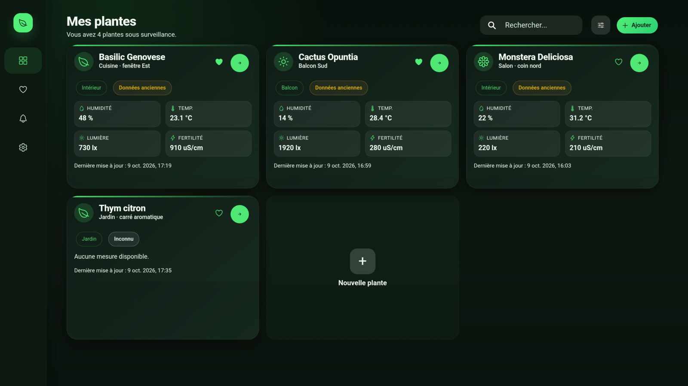
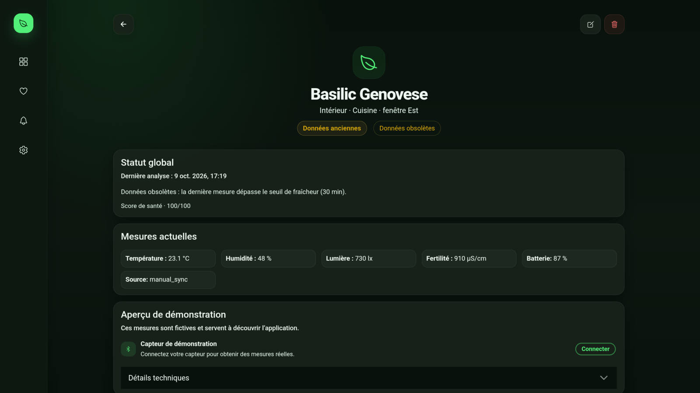
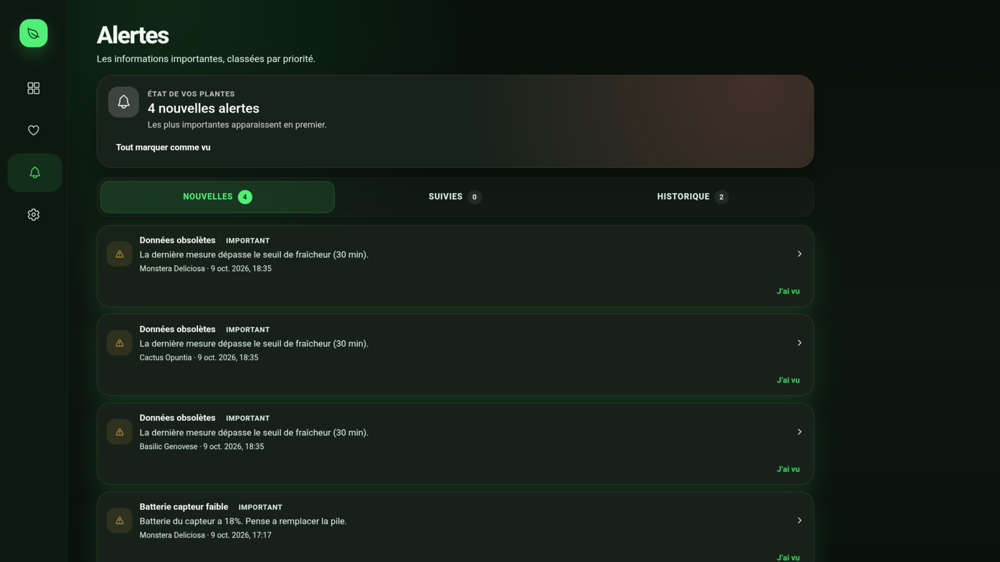
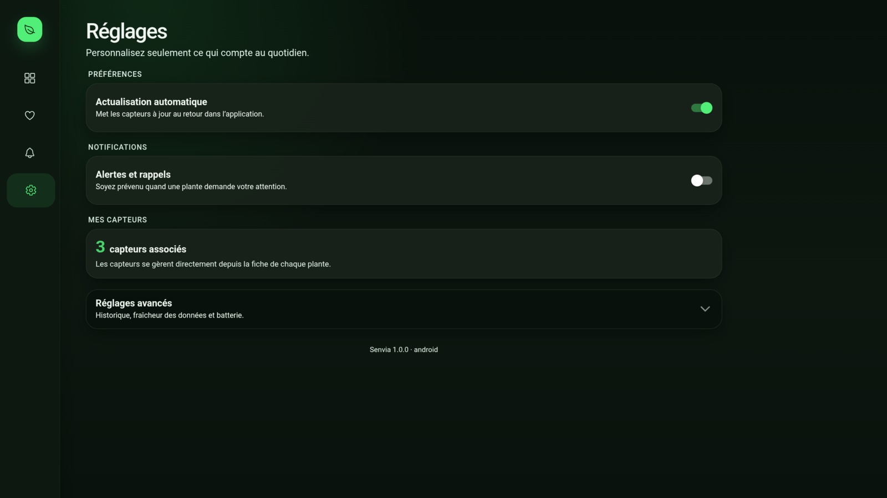

# Senvia

Senvia est une application mobile locale de suivi de plantes utilisant des capteurs Bluetooth Low Energy de type Flower Care / HHCC.

L'application fonctionne sans compte et sans serveur. Elle stocke les plantes, mesures et alertes dans SQLite, et les préférences générales via Capacitor Preferences.

## Aperçu

<table>
  <tr>
    <td width="50%"><strong>Tableau de bord</strong><br></td>
    <td width="50%"><strong>Fiche d’une plante</strong><br></td>
  </tr>
  <tr>
    <td width="50%"><strong>Alertes</strong><br></td>
    <td width="50%"><strong>Réglages</strong><br></td>
  </tr>
</table>

## Fonctionnalités V1

- ajout, modification et suppression de plantes ;
- association d'une plante avec un capteur BLE ;
- lecture de la température, de l'humidité du sol, de la lumière et de la conductivité ;
- dashboard, recherche et filtres ;
- favoris ;
- calcul du statut de santé selon un profil de seuils ;
- historique local avec graphiques sur 24 h, 7 jours, 30 jours ou toute la période ;
- alertes locales gérées comme des épisodes en cours puis résolus ;
- notifications locales selon une sévérité minimale ;
- synchronisation manuelle et au retour de l'application au premier plan ;
- identité visuelle sombre, optimisée pour téléphone et tablette ;
- fonctionnement hors ligne et sans compte.

## Stack

- Ionic 8 et Vue 3 ;
- TypeScript, Vite et Pinia ;
- Capacitor 8 ;
- `@capacitor-community/bluetooth-le` ;
- `@capacitor-community/sqlite` et `sql.js` pour le navigateur ;
- Capacitor Preferences, Local Notifications, Haptics et Toast.

## Prérequis

- Node.js 20 ou version LTS plus récente ;
- npm ;
- Android Studio et le SDK Android pour une compilation native ;
- JDK 21, requis par Capacitor 8 ;
- un appareil Android avec Bluetooth LE pour valider les lectures réelles ;
- Chrome ou Edge avec Web Bluetooth pour les essais web compatibles.

Le BLE web dépend du support Web Bluetooth du navigateur. La validation finale des permissions, du scan, des lectures et des notifications doit être faite sur un appareil Android réel.

## Installation

```bash
npm install
npm run dev
```

L'application web est ensuite disponible par défaut sur `http://localhost:5173`.

La commande de préparation copie automatiquement `sql-wasm.wasm` dans `public/assets` avant le développement et le build.

## Commandes

```bash
npm run dev
npm run build
npm run lint
npm run test:unit:run
npm run test:e2e
```

Pour les tests E2E, démarrer le serveur Vite dans un autre terminal avant `npm run test:e2e`.

## Android

L'identifiant Android est `io.senvia.app`.

Après une modification des dépendances Capacitor ou du build web :

```bash
npm run build
npx cap sync android
npx cap open android
```

Le dossier `android/` fait partie du projet et doit être versionné. Les permissions BLE et notifications sont déclarées dans `android/app/src/main/AndroidManifest.xml`.

Les données locales ne sont pas incluses dans les sauvegardes Android : la base SQLite contient l’historique des plantes et n’est pas chiffrée. Une désinstallation efface donc les plantes, mesures et alertes enregistrées.

### Signer l’APK installé manuellement

Le nom affiché dans l’application est `Mehdi (belcaid)`. L’identité technique d’un APK Android provient toutefois de son certificat de signature. Créez une seule clé release, conservez-la en lieu sûr et réutilisez-la pour toutes les versions :

```bash
cd android
keytool -genkeypair -v -keystore senvia-release.jks -alias senvia -keyalg RSA -keysize 2048 -validity 10000 -dname "CN=Mehdi (belcaid), O=Senvia"
cp keystore.properties.example keystore.properties
```

Renseignez ensuite les mots de passe dans `keystore.properties`, puis construisez l’APK release depuis Android Studio ou avec `./gradlew assembleRelease`. La clé et le fichier contenant les mots de passe sont exclus de Git. Une clé auto-signée rend les mises à jour cohérentes, mais ne donne pas à l’application la réputation d’une publication Google Play.

## Stockage et architecture

- `src/database/` : schéma, migrations, connexion SQLite et repositories ;
- `src/services/` : BLE, alertes, notifications, préférences et opérations atomiques ;
- `src/stores/` : état Pinia et orchestration de l'interface ;
- `src/views/` : écrans Ionic ;
- `src/utils/plant-health.util.ts` : calcul du score et du statut de santé.

L'association plante-capteur et l'enregistrement d'une mesure utilisent des transactions SQLite. Des triggers maintiennent également la cohérence entre `plants.sensor_id` et `sensor_devices.plant_id`.

## Données de démonstration

Les données de démonstration sont créées uniquement en mode développement. Un build de production démarre avec une base métier vide.

Le bouton de réinitialisation des données de démonstration n'est visible qu'en développement.

## Notifications et synchronisation

Les alertes sont créées à partir des seuils de la plante, de la fraîcheur des données et du niveau de batterie. Un problème persistant met à jour le même épisode au lieu de créer des doublons. Une aggravation repasse l'alerte en non lue et peut déclencher une nouvelle notification.

Le retrait ou le remplacement d'un capteur résout ses alertes actives sans supprimer l'historique. Les alertes résolues et lues depuis plus de 90 jours sont nettoyées automatiquement. La vue permet aussi de marquer toutes les alertes comme lues et d'effacer manuellement l'historique résolu déjà lu.

Le moteur d'alertes s'exécute au démarrage, après une synchronisation et au retour au premier plan. La synchronisation au retour au premier plan est disponible sur plateforme native. Les capteurs associés sont lus successivement afin d'éviter plusieurs connexions BLE concurrentes. Aucun scan BLE permanent en arrière-plan n'est utilisé dans la V1.

## Limites V1

- aucune synchronisation cloud ni sauvegarde distante ;
- aucune prise en charge iOS validée dans le dépôt ;
- compatibilité à confirmer sur chaque variante matérielle Flower Care / HHCC ;
- les tests automatisés ne remplacent pas les essais BLE et notifications sur appareil réel.

## Projet

Senvia est développé par Mehdi (`belcaid`) et distribué sous licence MIT. Consultez le fichier `LICENSE` pour les conditions de réutilisation.
